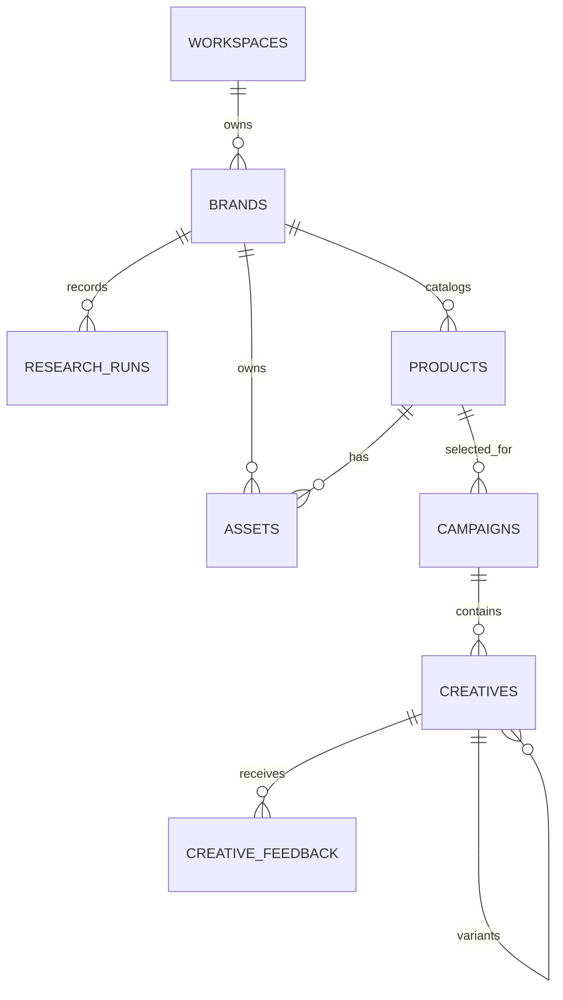

# Data model

AI Creative Studio uses one seeded demo workspace and server-only Supabase access. Row Level Security is enabled on every application table with no browser policies; the secret key is used only in Next.js server code. This matches the MVP decision to omit authentication while preventing direct public table access.

## Core relationships

## Why these tables exist

- `workspaces`: provides a clean ownership boundary even though the MVP has one demo workspace.
- `brands`: stores the editable brand kit. `evidence` records whether each value was extracted or inferred and what source supported it.
- `research_runs`: preserves attempts, raw provider output, progress, and recoverable failures without overwriting the accepted brand profile.
- `products`: the persistent catalog. Readiness status and issues make incomplete discoveries editable instead of dead ends.
- `assets`: tracks remote source images and durable Supabase copies with a clear lifecycle.
- `campaigns`: one chosen product and creative direction per generation run.
- `creatives`: stores copy, generation inputs, outputs, lifecycle status, and parent/child variant history.
- `creative_feedback`: keeps the user's exact instruction and links it to the resulting variant.

## Important boundaries

The catalog persists independently of campaigns, so a user researches a store once and can create multiple campaigns from different products. A campaign selects one product in the MVP. Each generation produces three root creatives; regeneration creates a new row with `parent_creative_id` pointing to the reviewed creative.

Assets store both the original remote URL and the Supabase bucket/path. This lets the app display provenance while using durable storage for the actual workflow. Buckets and storage policies are created in checklist step 6.

The deterministic demo workspace ID is `00000000-0000-0000-0000-000000000001`. Server code should use this ID until authentication is introduced.
